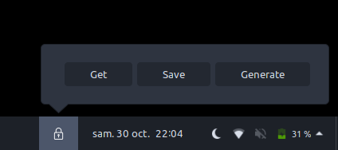
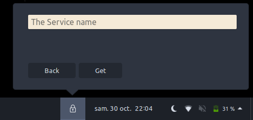
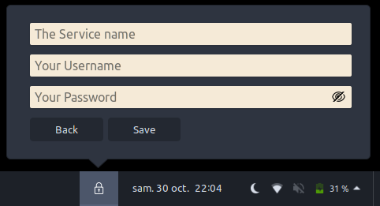
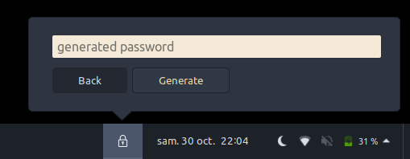

# password-gnome-extension

A gnome extension to manage your passwords

## How to use ?

**Make sur you have allow user extensions. @see : <https://doc.ubuntu-fr.org/extensions-gnome>**

- First clone the project with this command:

```sh
git clone https://github.com/Amayas29/password-gnome-extension
```

- then move the project to this directory : `~/.local/share/gnome-shell/extensions`

- restart gnome shell :

    `alt` + `f2`, then enter `r`

## Screens



---



---



---



## TODO

- [ ] Improve the project structure
- [ ] Imporve passwords encryption
- [ ] Change extension style
